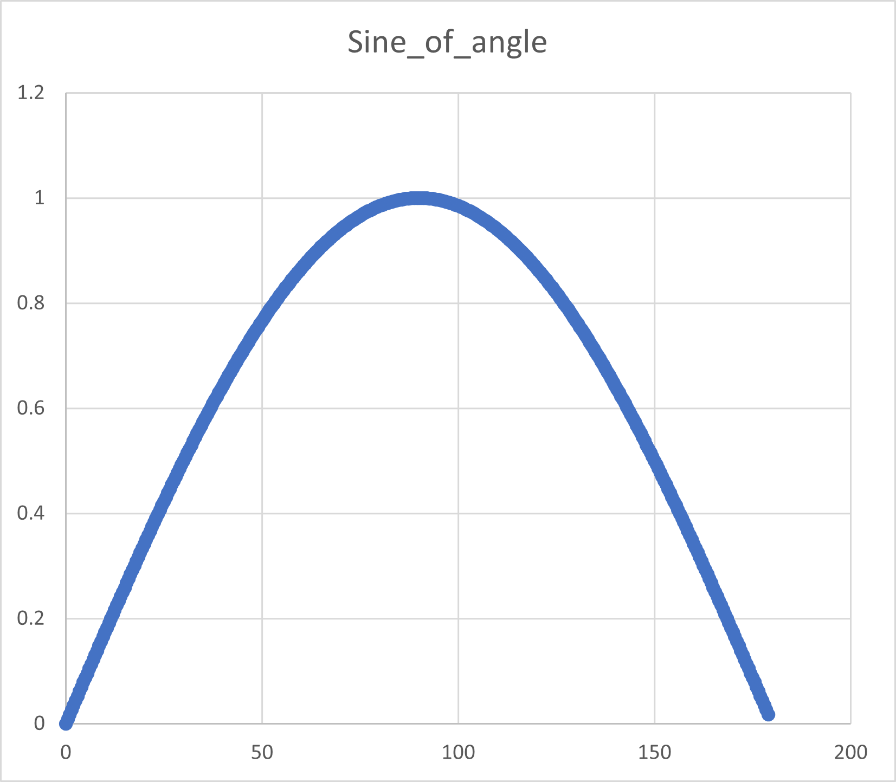

# Sine data set

This example shows that fuzzy logic rules can be used to simulate numeric functions.

No one, in practice, would use fuzzy logic for such a purpose, but it shows that arbitrary functions can be modelled, and Fuzzy rule systems, like neural nets, are universal approximators of any function not containing poles.

Accuracy is limited by the number of fuzzy sets that ThinkBase will generate for any variable during machine learning. This is capped at nine.
Lotfi Zadeh, the father of Fuzzy Logic, showed that great things could be achieved with relatively large granules in his work on [Granular computing](https://link.springer.com/chapter/10.1007/11908029_2).

Since Machine learning is mostly used for vague and uncertain data, nine sets seems to be a reasonable bound.

